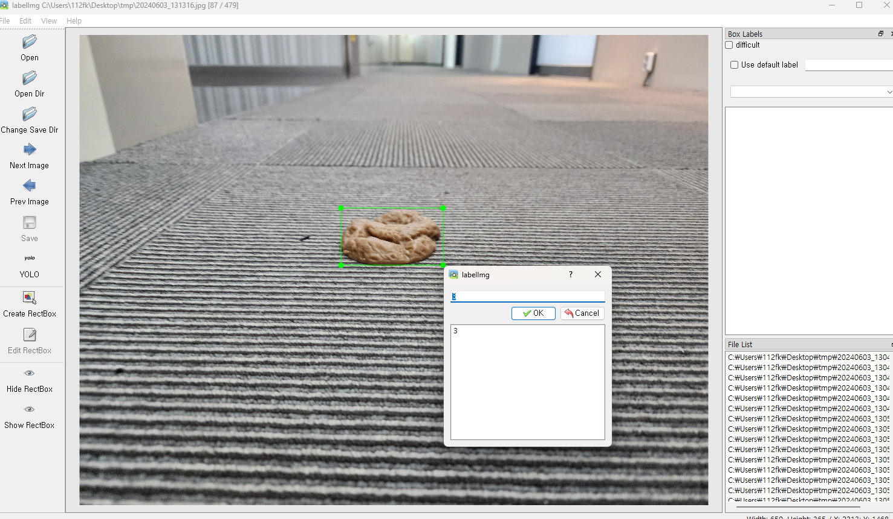

# 촬영 각도에 따른 mAP 측정 실험

검토 class list(240603): 대변, 소변, 물, 기타 액체, 카펫, 케이블, 체중계, 옷(옷/수건/양말/속옷등), 건조대, 책

현재 평가 class list(240603): 대변, 액체, 카펫, 케이블, 체중계, 옷, 건조대

## 셋업 관련
아래의 패키지들이 필요합니다:
- YOLOv7 패키지: [GitHub 링크](https://github.com/WongKinYiu/yolov7)
- 레이블링 툴: labelImg_exe_package_windows_v1.8.1/labelImg.exe
p.s: `pip install labelImg` (https://github.com/HumanSignal/labelImg) 로 설치하면 에러나서 프로그램 종료 됨.

## 원본 프로젝트에서 변경된 사항들
- custom_yolov7_inference.py
  1. 그릴 때 인자로 img와 dic_list를 넣게 바꿈
  2. cuda_check 함수 삭제
  3. base_weight_check 기능 삭제. 타 부서 배포용이 아니기 때문.
  4. roi 박스, center_point 등 필요없는 기능 삭제(class 입력 인자)
  5. conf_thresh=0.25, nms_thresh=0.45 위치를 class 선언에서 detect 함수로 변경. 매 detect마다 바뀔 수 있는게 편하다.
  6. 자동 리사이즈 기능 추가(입력 인자로 img_list 투입)
  7. filter를 detect로 옮김
