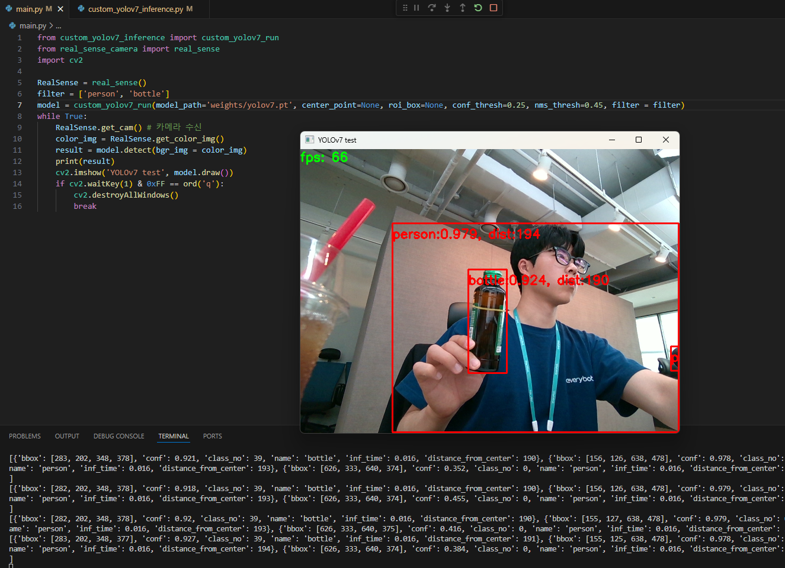

# Object Detection Package for Moving Platform


## Introduction
This project involves running the YOLOv7 object detection model at over 20fps using a CUDA accelerator on a RealSense camera module connected to a Jetson Orin Nano Developer Kit 8GB (JetPack 6.0).

### Object Detection Test Environment

1. **Hardware**: 
   - Moving platform, RealSense camera with 2D RGB sensor, Jetson Orin Nano Developer Kit 8GB.
   - RealSense Camera Model: D435(I don't know reason but failed to do with D455. It works in JetPack 4.2 or in Windows11 very well but have some problem with JetPack 6.0)(issue link: https://github.com/IntelRealSense/librealsense/issues/12894)
   - When the air purifier is installed: Change to NU4100 (2LL + 2D RGB sensor).

2. **Image Input Size for Object Detection AI Model**: 
   - YOLOv7 416x320 (same as the air purifier model).

3. **Obstacle Distance Detection Implementation**: 
   - Using pixel distance.

### Camera Specifications and Setup

- **Camera Specifications**: 
  - Image size should be confirmed and be 640x480 or less due to the large amount of image data. This minimizes the data load on the robot side.
  - The best model that can run on the NU4100, confirmed through various experiments, is YOLOv7 480x288, with a total of 138,240 pixels. The optimal image size for the NU4100, considering the modified global shutter image size and similar ratio, is 416x320 with 133,120 pixels.

- **Camera Setup**:
  - Two cameras are used to check two views simultaneously. The moving platform will have an upper view RealSense camera, while the air purifier will have an upper 2D RGB camera looking downwards.
  - The air purifier's 2D RGB camera will be installed at an angle looking down from above. Avoidance criteria will be created based on the pixel distance to detected objects. While the exact distance cannot be known, a rough avoidance method will be implemented.

## Development Details

We will develop an object detection package and deliver it to S/W team.

1. **Input Data**: Numpy image.
2. **Return Data**: List containing the results of object detection.
   - `class_name`: Name of the detected object.
   - `bbox`: Bounding box pixel coordinates of the detected object.
   - `conf`: Confidence of the detected object.
   - `dist`: Calculated straight-line pixel distance between the camera and the center point of the detected object (sorted by shortest distance).
   - Example return data: `[{‘class_name’: 'pee', ‘bbox’:[x1, y1, x2, y2], ‘conf’:0.79, ‘dist’:50}]`
3. **Object Detection Package Configuration Parameters**:
   - `conf_thresh`: Only detects objects with confidence above this threshold.
   - `jitter_cnt`: The object must be detected continuously for the specified counter to be recognized.
   - `roi`: Region Of Interest. A box defined by x1, y1, x2, y2, where object detection is performed within this area.
   - `nms_thresh`: IOU threshold to remove duplicate objects when multiple objects of the same class overlap.
   - `filter`: You can set default as None. Or add some classes that you want to detect only like ['person', 'bottle']
   - Note: These parameters may be changed as needed.

## Post-Development Plan

Using the provided object detection package, we plan to implement object avoidance during autonomous driving.

## Setup Guide

### Install pip3 Package
```sh
$ sudo apt update
$ sudo apt upgrade
$ sudo apt install python3-pip
```

### Install PyTorch
Follow the official guide below:
https://docs.nvidia.com/deeplearning/frameworks/install-pytorch-jetson-platform/index.html

You can simply follow:
```sh
$ sudo apt-get -y update
$ sudo apt-get -y install python3-pip libopenblas-dev
$ export TORCH_INSTALL=https://developer.download.nvidia.cn/compute/redist/jp/v511/pytorch/torch-2.0.0+nv23.05-cp38-cp38-linux_aarch64.whl
$ python3 -m pip install --upgrade pip
$ python3 -m pip install numpy=='1.26.1'
$ python3 -m pip install --no-cache $TORCH_INSTALL
```

Now, get the link below and download it:
https://developer.download.nvidia.com/compute/redist/jp/v60dp/pytorch/torch-2.3.0a0+ebedce2.nv24.02-cp310-cp310-linux_aarch64.whl

Open terminal in the "Downloads" folder and:
```sh
$ pip3 install torch-2.3.0a0+ebedce2.nv24.02-cp310-cp310-linux_aarch64.whl
```

Then, now PyTorch is installed. Let's check that PyTorch can be run with CUDA:
```sh
$ python3
$ import torch
$ torch.cuda.is_available()
```

If "True" prints, good! Type `exit()` to get out of python running.

### Install torchvision
Follow the link below for JetPack 6 with PyTorch v2.3.0 with CUDA 12.2:
https://forums.developer.nvidia.com/t/pytorch-for-jetson/72048

Install below:
```sh
$ sudo apt-get install libjpeg-dev zlib1g-dev libpython3-dev libopenblas-dev libavcodec-dev libavformat-dev libswscale-dev
$ git clone --branch v0.18.0 https://github.com/pytorch/vision torchvision
$ cd torchvision
$ export BUILD_VERSION=0.18.0
$ python3 setup.py install
```

It takes about 30 minutes to install. After installation, test it like below:
```sh
$ python3
$ import torch; torch.cuda.is_available()
```

If "True" is printed, it is ok with PyTorch. Now check torchvision.
```sh
$ import torchvision
$ torchvision.__version__
```

If some version is printed, it is OK. But we might get some error about numpy when torchvision is imported. So follow below to solve it.

### Reinstall numpy
```sh
$ sudo apt-get remove python3-numpy
$ pip install numpy
```

### Install YOLOv7 Package
```sh
$ pip3 install -r requirements.txt
```

If you get an error about RealSense, follow the commands below to solve it. These commands are various ways and installations searched on Google by my own. So there can be useless steps, please refer to it.

### Install RealSense Package
First, remove the pyrealsense2 package that you installed by requirements.txt:
```sh
$ pip3 uninstall pyrealsense2
```

And install necessary packages:
```sh
$ sudo apt-get update
$ sudo apt-get upgrade
$ sudo apt-get install -y git libssl-dev libusb-1.0-0-dev pkg-config libgtk-3-dev
$ sudo apt-get install -y libglfw3-dev libgl1-mesa-dev libglu1-mesa-dev
```

SDK install:
```sh
$ git clone https://github.com/IntelRealSense/librealsense.git
$ cd librealsense
$ ./scripts/setup_udev_rules.sh
$ ./scripts/patch-realsense-ubuntu-L4T.sh
```
(You may get an error with jetpack version. Do not mind and go on)

```sh
$ mkdir build
$ cd build
$ cmake ../ -DFORCE_LIBUVC=ON -DCMAKE_BUILD_TYPE=Release
$ make -j4
$ sudo make install
```

USB sudo issue:
```sh
$ sudo usermod -aG video $USER
$ sudo udevadm control --reload-rules && sudo udevadm trigger
```

Realsense libuvc installation:
Go to the link: https://github.com/IntelRealSense/librealsense/blob/master/scripts/libuvc_installation.sh and download the sh file, then:
```sh
$ cd Downloads
$ sudo chmod +x libuvc_installation.sh
$ ./libuvc_installation.sh
$ cd /Downloads
$ git clone https://github.com/jetsonhacks/installRealSenseSDK.git
$ cd installRealSenseSDK
$ ./installLibrealsense.sh
```

Finish! Now let's run:
```sh
$ python3 main.py
```
and check YOLOv7 on RealSense Camera with Jetson Orin Nano Developer Kit deployment!



## 한국어 번역(Korean)
이 프로젝트는 Jetson Orin Nano Developer Kit 8GB (JetPack 6.0)에 연결된 RealSense 카메라 모듈에서 CUDA 가속기를 사용하여 20fps 이상의 속도로 YOLOv7 객체 탐지 모델을 실행하는 것을 포함합니다.

### 객체 탐지 테스트 환경

1. **하드웨어**:
   - 이동 플랫폼, 2D RGB 센서가 있는 RealSense 카메라, Jetson Orin Nano Developer Kit 8GB.
   - RealSense 카메라 모델: D435(이유는 모르겠지만 D455로는 실패했습니다. JetPack 4.2 또는 Windows11에서는 잘 작동하지만 JetPack 6.0에서는 문제가 있습니다)(이슈 링크: https://github.com/IntelRealSense/librealsense/issues/12894)
   - 공기청정기가 설치된 경우: NU4100(2LL + 2D RGB 센서)로 변경합니다.

2. **객체 탐지 AI 모델의 이미지 입력 크기**:
   - YOLOv7 416x320 (공기청정기 모델과 동일).

3. **장애물 거리 탐지 구현**:
   - 픽셀 거리를 사용합니다.

### 카메라 사양 및 설정

- **카메라 사양**:
  - 이미지 크기는 640x480 이하로 확인해야 합니다. 이는 많은 양의 이미지 데이터를 줄여 로봇 측의 데이터 부하를 최소화합니다.
  - 다양한 실험을 통해 NU4100에서 실행할 수 있는 최적의 모델은 총 138,240 픽셀의 YOLOv7 480x288입니다. 수정된 글로벌 셔터 이미지 크기와 비슷한 비율을 고려한 NU4100의 최적 이미지 크기는 133,120 픽셀의 416x320입니다.

- **카메라 설정**:
  - 두 개의 카메라를 사용하여 두 개의 뷰를 동시에 확인합니다. 이동 플랫폼에는 상단 뷰 RealSense 카메라가, 공기청정기에는 상단에서 아래를 향하는 2D RGB 카메라가 설치됩니다.
  - 공기청정기의 2D RGB 카메라는 위에서 아래를 내려다보는 각도로 설치됩니다. 탐지된 물체에 대한 픽셀 거리를 기준으로 회피 기준을 생성할 것입니다. 정확한 거리는 알 수 없지만 대략적인 회피 방법이 구현될 것입니다.

## 개발 세부 사항

우리는 객체 탐지 패키지를 개발하여 S/W 팀에 제공할 것입니다.

1. **입력 데이터**: Numpy 이미지.
2. **반환 데이터**: 객체 탐지 결과를 포함하는 리스트.
   - `class_name`: 탐지된 객체의 이름.
   - `bbox`: 탐지된 객체의 바운딩 박스 픽셀 좌표.
   - `conf`: 탐지된 객체의 신뢰도.
   - `dist`: 카메라와 탐지된 객체 중심점 사이의 직선 픽셀 거리(가장 짧은 거리 순으로 정렬됨).
   - 반환 데이터 예: `[{‘class_name’: 'pee', ‘bbox’:[x1, y1, x2, y2], ‘conf’:0.79, ‘dist’:50}]`
3. **객체 탐지 패키지 구성 매개 변수**:
   - `conf_thresh`: 이 임계값보다 높은 신뢰도의 객체만 탐지합니다.
   - `jitter_cnt`: 객체가 인식되기 위해 지정된 카운터 동안 연속적으로 탐지되어야 합니다.
   - `roi`: 관심 영역. 객체 탐지가 이 영역 내에서 수행되는 x1, y1, x2, y2로 정의된 박스입니다.
   - `nms_thresh`: 동일 클래스의 여러 객체가 겹칠 때 중복 객체를 제거하는 IOU 임계값입니다.
   - `filter`: 기본값은 None으로 설정할 수 있습니다. 또는 ['person', 'bottle']과 같이 탐지하고자 하는 클래스만 추가할 수 있습니다.
   - 참고: 이러한 매개 변수는 필요에 따라 변경될 수 있습니다.

## 개발 후 계획

제공된 객체 탐지 패키지를 사용하여 자율 주행 중 객체 회피를 구현할 계획입니다.

## 설정 가이드

### pip3 패키지 설치
```sh
$ sudo apt update
$ sudo apt upgrade
$ sudo apt install python3-pip
```

### PyTorch 설치
공식 가이드를 따르세요:
https://docs.nvidia.com/deeplearning/frameworks/install-pytorch-jetson-platform/index.html

아래 명령어를 따르세요:
```sh
$ sudo apt-get -y update
$ sudo apt-get -y install python3-pip libopenblas-dev
$ export TORCH_INSTALL=https://developer.download.nvidia.cn/compute/redist/jp/v511/pytorch/torch-2.0.0+nv23.05-cp38-cp38-linux_aarch64.whl
$ python3 -m pip install --upgrade pip
$ python3 -m pip install numpy=='1.26.1'
$ python3 -m pip install --no-cache $TORCH_INSTALL
```

아래 링크를 통해 다운로드하세요:
https://developer.download.nvidia.com/compute/redist/jp/v60dp/pytorch/torch-2.3.0a0+ebedce2.nv24.02-cp310-cp310-linux_aarch64.whl

"Downloads" 폴더에서 터미널을 열고:
```sh
$ pip3 install torch-2.3.0a0+ebedce2.nv24.02-cp310-cp310-linux_aarch64.whl
```

이제 PyTorch가 설치되었습니다. CUDA와 함께 PyTorch가 실행될 수 있는지 확인하세요:
```sh
$ python3
$ import torch
$ torch.cuda.is_available()
```

"True"가 출력되면 성공입니다! `exit()`을 입력하여 python을 종료하세요.

### torchvision 설치
JetPack 6과 CUDA 12.2가 포함된 PyTorch v2.3.0용 링크를 따르세요:
https://forums.developer.nvidia.com/t/pytorch-for-jetson/72048

아래 명령어를 설치하세요:
```sh
$ sudo apt-get install libjpeg-dev zlib1g-dev libpython3-dev libopenblas-dev libavcodec-dev libavformat-dev libswscale-dev
$ git clone --branch v0.18.0 https://github.com/pytorch/vision torchvision
$ cd torchvision
$ export BUILD_VERSION=0.18.0
$ python3 setup.py install
```

설치에는 약 30분이 소요됩니다. 설치 후, 아래와 같이 테스트하세요:
```sh
$ python3
$ import torch; torch.cuda.is_available()
```

"True"가 출력되면 PyTorch가 제대로 작동합니다. 이제 torchvision을 확인하세요.
```sh
$ import torchvision
$ torchvision.__version__
```

어떤 버전이 출력되면 정상입니다. 하지만 torchvision을 가져올 때 numpy와 관련된 오류가 발생할 수 있습니다. 이를 해결하려면 아래를 따르세요.

### numpy 재설치
```sh
$ sudo apt-get remove python3-numpy
$ pip install numpy
```

### YOLOv7 패키지 설치
```sh
$ pip3 install -r requirements.txt
```

RealSense와 관련된 오류가 발생하면, 아래 명령어를 따라 해결하세요. 이 명령어들은 구글에서 검색한 다양한 방법과 설치 과정입니다. 불필요한 단계가 있을 수 있으니 참고하세요.

### RealSense 패키지 설치
먼저, requirements.txt로 설치한 pyrealsense2 패키지를 제거하세요:
```sh
$ pip3 uninstall pyrealsense2
```

필요한 패키지를 설치하세요:
```sh
$ sudo apt-get update
$ sudo apt-get upgrade
$ sudo apt-get install -y git libssl-dev libusb-1.0-0-dev pkg-config libgtk-3-dev
$ sudo apt-get install -y libglfw3-dev libgl1-mesa-dev libglu1-mesa-dev
```

SDK 설치:
```sh
$ git clone https://github.com/IntelRealSense/librealsense.git
$ cd librealsense
$ ./scripts/setup_udev_rules.sh
$ ./scripts/patch-realsense-ubuntu-L4T.sh
```
(JetPack 버전과 관련된 오류가 발생할 수 있습니다. 무시하고 진행하세요)

```sh
$ mkdir build
$ cd build
$ cmake ../ -DFORCE_LIBUVC=ON -DCMAKE_BUILD_TYPE=Release
$ make -j4
$ sudo make install
```

USB sudo 문제 해결:
```sh
$ sudo usermod -aG video $USER
$ sudo udevadm control --reload-rules && sudo udevadm trigger
```

Realsense libuvc 설치:
링크로 이동하세요: https://github.com/IntelRealSense/librealsense/blob/master/scripts/libuvc_installation.sh 그리고 sh 파일을 다운로드한 후:
```sh
$ cd Downloads
$ sudo chmod +x libuvc_installation.sh
$ ./libuvc_installation.sh
$ cd /Downloads
$ git clone https://github.com/jetsonhacks/installRealSenseSDK.git
$ cd installRealSenseSDK
$ ./installLibrealsense.sh
```

마무리! 이제 실행하세요:
```sh
$ python3 main.py
```
그리고 Jetson Orin Nano Developer Kit에서 RealSense 카메라로 YOLOv7을 확인하세요!

